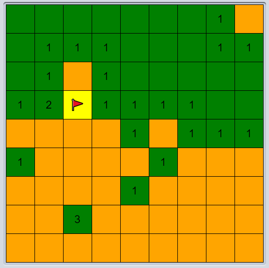

# MinesweeperGame

Java Implementation of Minesweeper game. Goal of game is to reveal tiles which do not contain mines.
Revealed tiles show the number of adjacent neighbouring tiles which contain mines. Use this number to figure out mine tiles to avoid.
This games uses codegym's Game class library.
Play my game here: https://codegym.cc/projects/apps/42610

## Controls
1. Reveal tile with mouse left click.
2. Flag tile with mouse right click.
3. If game ends, restart game by mouse left click.

## Rules
1. Game over if any mine tile is revealed.
2. Game is won if all non-mine tiles  have been revealed.

## References
1. https://codegym.cc/projects/games/com.codegym.games.minesweeper
